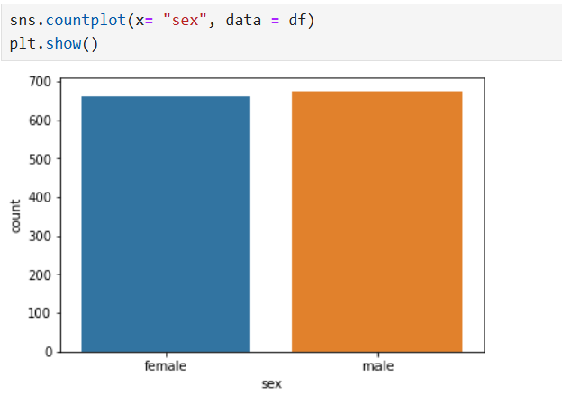
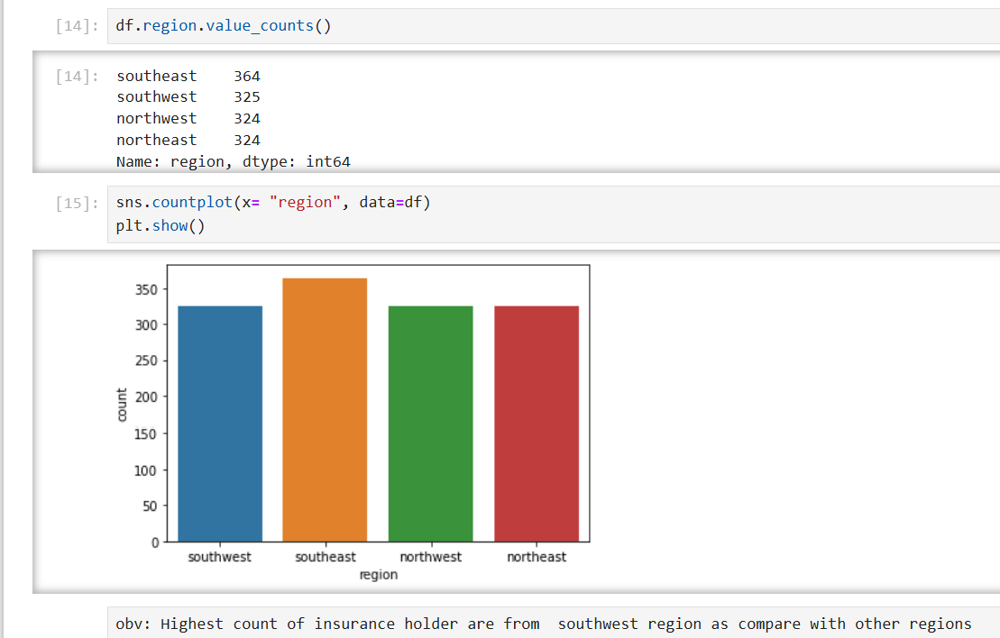
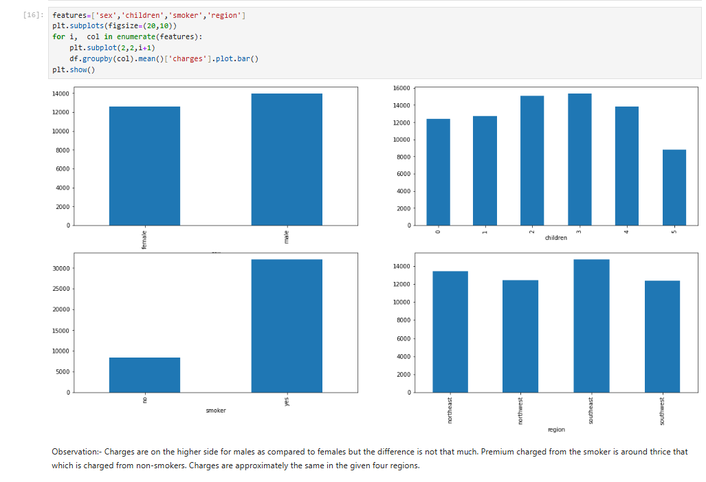
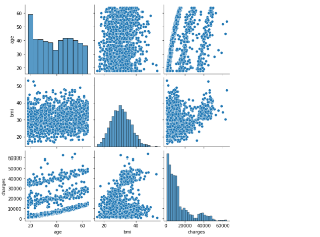

# insurance-cost-prediction
Machine Learning project for predicting insurance charges using Python and scikit-learn.
# 🏥 Insurance Cost Prediction using Machine Learning

## 📌 Project Overview

Healthcare insurance providers need accurate estimates of medical insurance charges to improve pricing strategies and risk assessment. This project develops a machine learning regression model that predicts individual insurance charges based on demographic and lifestyle factors.

The project demonstrates the complete machine learning workflow, including data preprocessing, exploratory data analysis (EDA), feature engineering, model training, evaluation, and prediction.

---

## 🎯 Business Problem

Estimating insurance costs manually is time-consuming and may lead to inconsistent pricing decisions.

This project aims to build a predictive model that helps estimate insurance charges based on customer information such as:

* Age
* Gender
* BMI
* Number of Children
* Smoking Status
* Region

---

## 📊 Dataset

The dataset contains customer demographic and health-related information.

### Features

| Feature  | Description                              |
| -------- | ---------------------------------------- |
| age      | Age of the insured person                |
| sex      | Gender                                   |
| bmi      | Body Mass Index                          |
| children | Number of dependent children             |
| smoker   | Smoking status                           |
| region   | Residential region                       |
| charges  | Medical insurance cost (Target Variable) |

---

# 🛠 Technologies Used

* Python
* Pandas
* NumPy
* Matplotlib
* Seaborn
* Scikit-learn
* Jupyter Notebook

---

# 📈 Exploratory Data Analysis (EDA)

The following analyses were performed:

* Distribution of insurance charges
* Smoker vs Non-Smoker comparison
* Regional distribution
* Age vs Insurance Charges
* Correlation Analysis
* Pair Plot Visualization

---

# 📷 Project Visualizations

### Smoker Distribution



---

### Region Distribution



---

### Age vs Insurance Charges



---

### Pair Plot



---

## ⚙️ Data Preprocessing

The dataset was prepared using the following steps:

* Missing value verification
* Duplicate record removal
* Label Encoding of categorical variables
* Feature selection
* Data normalization where required
* Train-Test Split

---

# 🤖 Machine Learning Workflow

1. Data Collection
2. Data Cleaning
3. Exploratory Data Analysis
4. Feature Engineering
5. Model Selection
6. Model Training
7. Model Evaluation
8. Prediction

---

## 📏 Model Evaluation

Performance was evaluated using standard regression metrics, including:

* Mean Absolute Error (MAE)
* Mean Squared Error (MSE)
* Root Mean Squared Error (RMSE)
* R² Score

---

## 📂 Repository Structure

```
insurance-cost-prediction/
│
├── README.md
├── insurance_cost_prediction.ipynb
├── insurance.csv
├── smoker_countplot.png
├── region_countplot.png
├── age_vs_charges.png
├── pairplot.png
```

---

## 🚀 How to Run

## 🚀 How to Run

```bash
git clone https://github.com/Mrunalsonekar/insurance-cost-prediction.git
cd insurance-cost-prediction
pip install -r requirements.txt
jupyter notebook insurance_cost_prediction.ipynb
```

3. Open the notebook

```
jupyter notebook insurance_cost_prediction.ipynb
```

---

## 💡 Key Insights

* Smoking status has the strongest influence on insurance charges.
* Insurance costs generally increase with age.
* Higher BMI is associated with increased medical expenses.
* Regional differences have relatively smaller effects compared to smoking and age.

---

## 📌 Future Improvements

* Hyperparameter tuning
* Cross-validation
* Ensemble learning models
* Model deployment using Streamlit
* Docker containerization
* Cloud deployment

---

## 👤 Author

**Mrunal Sonekar**

Aspiring Data Scientist | Data Analyst | Machine Learning Enthusiast

If you found this project useful, consider giving it a ⭐ on GitHub.
